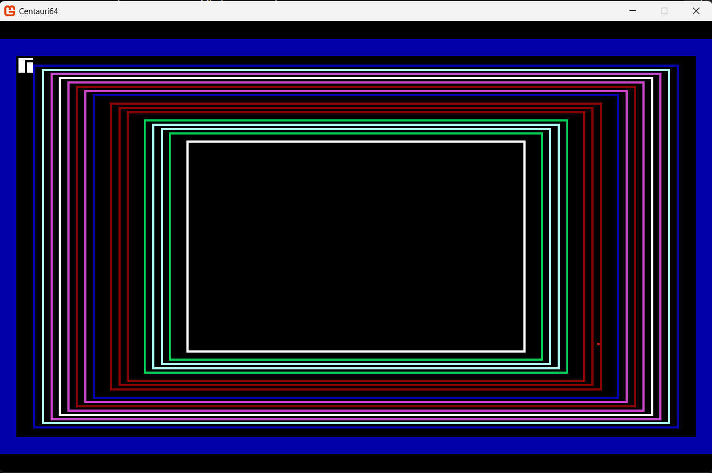
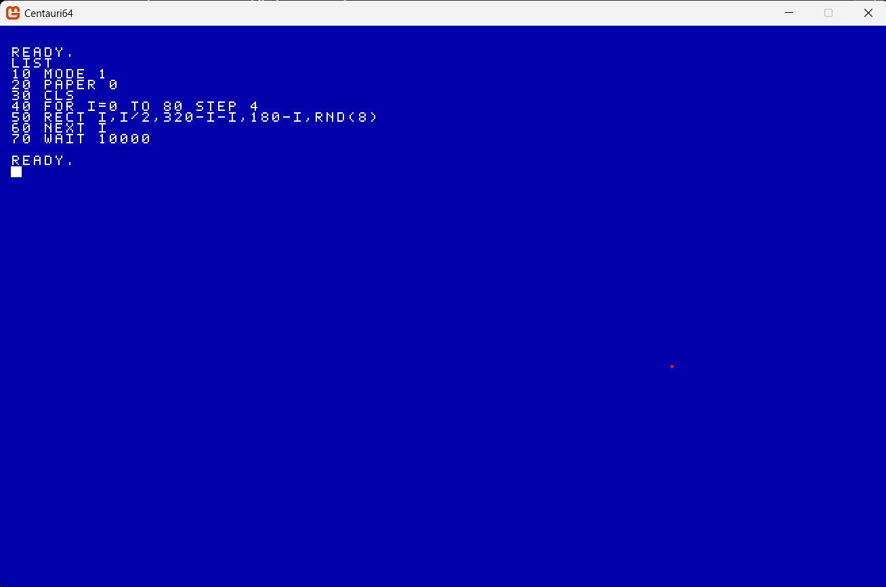
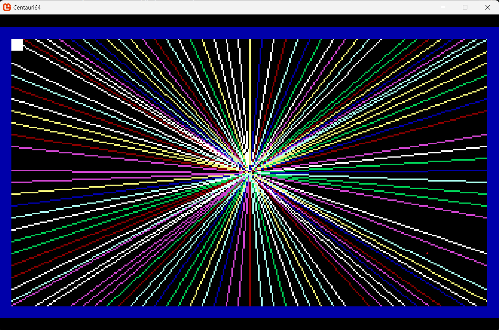

# Centauri64

Centauri64 is a fantasy home computer and programming game inspired by the bedroom coding era of the 1980s.

It isn't trying to emulate a real computer. The idea is to recreate the experience of getting your first computer, learning how it works, typing programs in from magazines and eventually creating games of your own.

The project is written in C# using MonoGame and includes a custom BASIC-style language, editor, interpreter, graphics system, sprites, sound and input.

## Centauri BASIC

Centauri64 has its own BASIC-inspired programming language.

I wanted it to feel familiar to anyone who used computers such as the C64 or ZX Spectrum, while not being restricted by the limitations those machines had.

Programs use traditional line numbers and can be entered directly into the Centauri64 computer.

For example:

```basic
10 MODE 1
20 PAPER 0
30 CLS
40 FOR I=0 TO 80 STEP 4
50 RECT I,I/2,320-I-I,180-I,RND(8)
60 NEXT I
70 WAIT 10000
```

That small program produces this:



The language is being built alongside the games that run on it. Rather than adding commands just because BASIC used to have them, I am adding features as the games need them.

## Type-In Programs

One of the main ideas behind Centauri64 is bringing back magazine type-in programs.

In the 1980s you could buy a computer magazine, find a program listing and spend an evening typing it into your computer. Sometimes it worked. Sometimes you spent the rest of the evening trying to find the line you had typed incorrectly.

Centauri64 will have magazines containing programs that can be typed into the computer.

Here is a small Centauri BASIC program entered directly into the machine:



And the result when the program is run:


Some will be useful programs, some will demonstrate programming techniques and others will be complete small games.

The idea is that the player learns Centauri BASIC naturally by using the computer.

Programs aren't just static examples. They run through the same tokenizer, parser and interpreter used by anything else written in Centauri BASIC, so the player can LIST them, change them, break them and hopefully improve them.

## Graphics

Centauri64 currently has two display modes, including a 320x180 arcade mode designed for games.

The graphics API currently includes:

- `PLOT`
- `LINE`
- `RECT`
- `RECT ... FILL`
- `CIRCLE`
- `CIRCLE ... FILL`
- `INK`
- `PAPER`
- `BORDER`
- `CLS`

The commands are deliberately simple, but loops and expressions can already produce some nice old-school graphics effects.



More graphics commands will be added as the demo games need them.

## Sprites

Centauri64 also has a sprite system for making games.

Sprites can be loaded, positioned, shown and hidden from BASIC, with collision detection handled by the machine.

There is also an in-built sprite editor. The intention is that the computer eventually contains the tools needed to make a complete game without leaving Centauri64.

## Sound and Input

Basic sound is currently available through `BEEP`, with more audio support planned.

Keyboard/game input is exposed to BASIC so programs can be interactive rather than just graphical demonstrations.

## Current Language Features

Centauri BASIC currently supports things including:

- Line numbered programs
- Immediate commands
- Variables and expressions
- `IF / THEN`
- `GOTO`
- `GOSUB`
- `FOR / NEXT`
- Positive and negative `STEP`
- `PRINT`
- `PRINTAT`
- `WAIT`
- `SAVE / LOAD`
- Keyboard input
- Graphics
- Sprites
- Collision detection
- Sound

There is still a lot I want to add, but the aim is to add features by actually using the language rather than designing everything up front.

## Demo Games

The language and machine are being developed by building games with them.

The planned demos are deliberately different so that each one puts pressure on a different part of the system.

### Arcade Game

A Galaxian/Galaga-style game will exercise sprites, movement, collision detection, sound, scoring and arcade-style gameplay.

### Text Adventure

A text adventure will exercise strings, input, branching, game state and the text side of the machine.

### Platform Game

A platformer will push sprites, collision detection, animation, scrolling and level data further.

The demos are also useful for finding where the language is awkward to use. If something takes far too much BASIC to achieve, that is usually a sign that the machine needs a better command or API.

## The Game Around the Computer

Centauri64 isn't intended to be just a BASIC interpreter.

The computer exists inside a larger game inspired by being a bedroom coder.

The player will be able to buy magazines, discover type-in programs, use utilities, write games and gradually learn more about the machine.

Other ideas being worked towards include computer shops, software, challenges, a BBS-style community and sharing programs with other players.

I want progression to come from learning what you can make the computer do rather than simply unlocking a list of abilities.

## Multiplayer

One of the longer-term goals is to make multiplayer programming unusually easy.

Rather than requiring somebody using Centauri BASIC to understand sockets, replication or networking infrastructure, I want the machine to provide simple multiplayer concepts that can be used to build small networked games.

A simple networked Tank Battle game is planned as the main test/tutorial for this.

If that can be written in a small and understandable BASIC program, the multiplayer API is doing its job.

## Technical

Centauri64 is currently built with:

- C#
- .NET
- MonoGame
- Custom tokenizer
- Custom parser
- Custom BASIC interpreter
- Virtual display modes
- Bitmap font rendering
- Retained graphics primitives
- Sprite rendering and collision
- Keyboard input
- Audio

The project is also being used as an excuse for me to keep experimenting with language design, game architecture, rendering, tooling and eventually networking.

The machine code is being split into focused systems for graphics, sprites, text and audio as those systems grow.

## Project Status

Centauri64 is under active development.

At the moment the focus is on getting enough of the language and machine implemented to build the first set of complete demo games.

Those games will then drive what gets added next.

There will probably be bugs.

That feels appropriate for a computer where you are expected to type programs in from magazines.